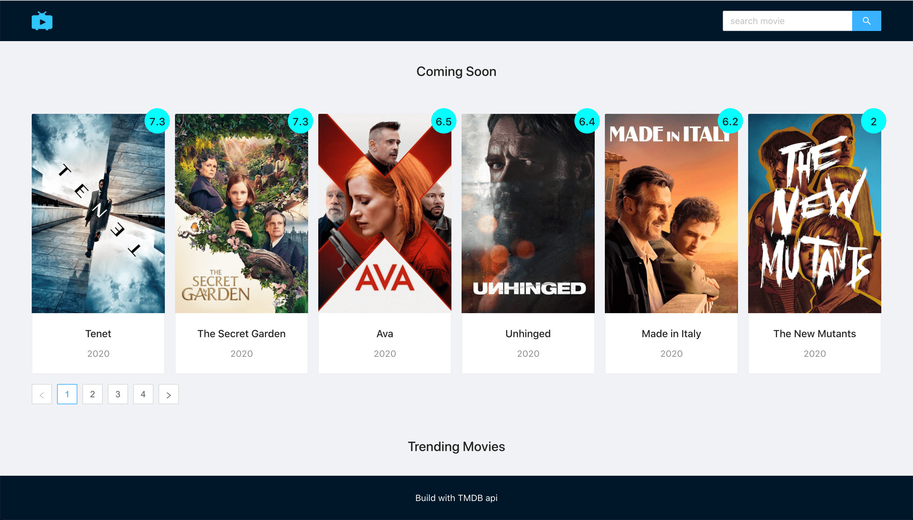

## Movie Info Hub
An interactive movie and tv series information hub where one can find contents about newly released, trending, top rated, etc movies or tv series. on another feature of this app is, you can search your targeted movie to get details information.

### live preview: https://movieinfohub.netlify.app/

## Technology used:
- TypeScript with ReactJS
- Ant Design for ui components
- Axios for data fetching

## Objectives
This project is based on incoming data, so i learned how to handle data and send it via different components via props.
I got some ideas about how TypeScript works with React.
From this project i learned how to add pagination component. 
